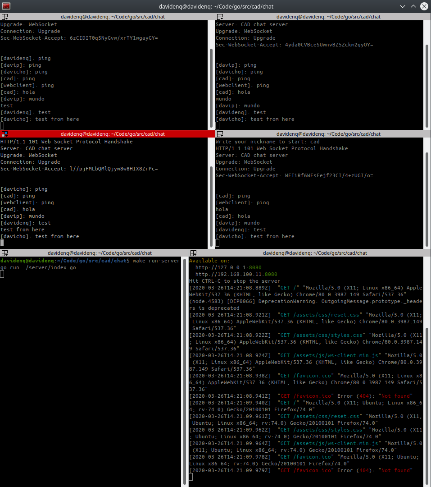
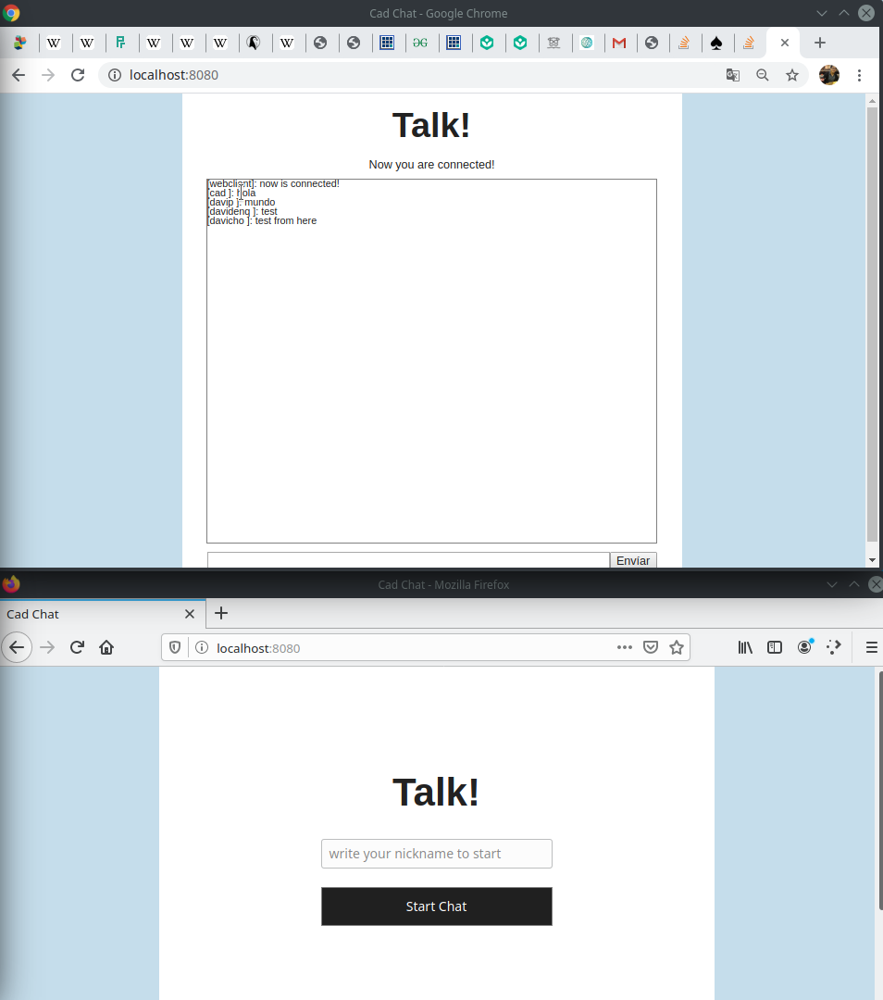
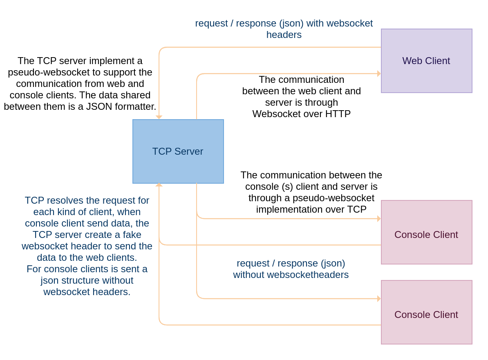

# Distributed Chat System

## Instructions given

Implement a program that allow you to chat with other instances of the same program. The program should allow you to start two instances of the program, and when you type something on one side, it will be reflected on the other side as well. If you want to incorporate user names for the two sides, that would be nice as well. 
The above description is the basic version. For extra effort, you can implement a version that allows more than two people to talk to each other. And for even more extra effort, make a version that allow people to talk between programs that are running on different computers.

## Check list following the above instructions

- [x] Implement a program that allow you to chat with other instances of the same program.
- [x] Running two instances of the program to talk with each other. (fullduplex communication).
- [x] Show a username in both sides.
- [x] Running more that two instances to talk with each other.

**_IMPORTANT_**

1. This implementation has been proved only on `Linux version 5.3.0-42-generic (buildd@lcy01-amd64-026) (gcc version 9.2.1 20191008 (Ubuntu 9.2.1-9ubuntu2))`

4. Has been implemented additional features to generate web and command lines clients to talk with other.

## Dependencies

In order to test the implementation you need to have installed in your computer the below dependencies.

`go > 1.10`
`nodejs > 12`
`npm`
`Docker`
`docker-compose`
`make`

## Before to start

Since that there are a web client there are some dependencies that have been used to develop. For example, rollup with babel are using to generate bundles and transpile from ES6 to ES5 for supporting it in the majority of web-browsers. For that reason, it's important to install the dependencies if you want to test the web client.

`$ make install-dependencies`

## How to start

Run from console:

1. Run the server: `make run-server` start a golang TCP server to listen the client connections.
2. Run the console client: `make run-console` (You can run as many times as you want to test)
3. Run the web client: `make run-web` (You can run as many times as you want to test although it is not require because you can use different kind of web browsers.) Open localhost:8080 in your web-browser.

When you running at the first time the above commands, the console clients and the web client require that you write an username to start.



# How it works.

Talks supports different kinds of clients such as console client and web client. In order to support those kind of clients, a pseudo-Websocket has been implemented (see `websocket.go into cad/chat/server/core/websocket.go`). Why speudo? because the implementation has a very basic frame structure and that implementation doesn't suppport all the websocket standard. Only the most basic to make a communication between clients.
The console client doesn't require a websocket because it can directly communicate through TCP channels. But when it wants to connect to the server, the first frame sent to the server is a frame with http and websocket headers to trick the server and the server register the console client in an array that contains a current context for each client connected (with all about the tcp connection) (see `poll.go into cad/chat/server/core/poll.go`). This array allow us to simulate a broadcasting flow.

A web client, at the first time, by default sent a frame with websocket information and http headers to require to connect to the server, the server check the headers and sent a key confirmation, the web client recieve the response with a standard information to persist a connection between then (web and server). 

To achieve the messages arrive to all clients, a broadcasting is making every time that some client send a message to the server. As the array contains all the clients connected (with context for each client - context that contains the TCP connection). 

Since that some console client doesn't send messages with websocket headers for each request, in code is generate a fake websocket header to send to the web clients. For the console clients a json structure is sent.



## Folder structure

```
├── chat/
│  ├── clients/
│  │   ├── console /
│  │   ├── web /
│  │   │   ├── assets /
│  │   │   │   ├── css /
│  │   │   │   ├── js /
│  │   │   │   │   ├── ws-client.min.js
│  │   │   ├── node_modules /
│  │   │   ├── src /
│  │   │   │   ├── documentHandler.js
│  │   │   │   ├── main.js
│  │   │   │   ├── webSocket.js
│  │   │   ├── .babelrc
│  │   │   ├── docker-compose.yaml
│  │   │   ├── Dockerfile
│  │   │   ├── index.html
│  │   │   ├── package-lock.json
│  │   │   ├── package.json
│  │   │   ├── rollup.config.js
│  ├── server/
│  │   ├── core /
│  │   │   ├── poll.go
│  │   │   ├── response.go
│  │   │   ├── websocket.go
│  │   ├── handler
│  │   │   ├── web.go
│  │   ├── index.go
```
`clients/console` contains a golang file to run client console. This client implement a very basic TCP client with custom headers to send to the server. (websocket headers)
`clients/web` contains just html css and javascript files to generate an web interface and handle websocket connections with the standard javascript libraries. A http-server is used to serve the index.html and the index.html load the bundle resources. (the statics resources such as css and javascript are serve by the server) _Note. the server is not an own implementatio is a library used to serve the static resources no more, no less._
`clients/web/assets` contains the finals static resources to be sent to the browser. The plugins rollup and babel generate a javascript bundle.
`clients/web/src` In this place is located all about the chat logic.

`.babelerc and rollup.config.js` contains settings to generate transpilation from ES6 to ES5 and final minified bundle.

The rest of files inside server folder contains all the logic of the TCP server to handle request and responses through TCP and HTTP protocols (very basic implementations without standards).
`server/core`
`server/handler`
`index.go`

## Background and Experience

This project is a basic distributed system (client-server architecture) where there are two kinds of clients: web client and command line client.

Since that this is just a prototype, there are a lot of things that have not been considered to be implemented, things like the flow data security between clients and server, frame validations (for websocket), high concurrency and so on.

In the other hand, some requirements were given. For instance, "don't use external libraries, just standard libraries". For that reason, the majority of implementation doesn't follow strictly the standards. For instance, the websocket protocol over TCP protocol. The websocket protocol library provide by golang it's not part of the standar library. For thar reason has been implementen a very basic websocket procotol over TCP in order to support the communication between console and web clients. This implementation for the websocket protocol is a very bad implementation because doesn't follow the standards as such but also only to support the basic communication.


## Resources to implement this chat proof of concept

- [Implementing websocket protocol in go over HTTP](https://hassansin.github.io/implementing-websocket-protocol-in-go)
- [How to build websockes in go](https://yalantis.com/blog/how-to-build-websockets-in-go/)
- [Getting http headers from tcp connections](https://stackoverflow.com/questions/34530628/getting-http-headers-from-tcp-connections)
- [How do websockets work](https://sookocheff.com/post/networking/how-do-websockets-work/)
- [Keep alive http request in golang](https://awmanoj.github.io/tech/2016/12/16/keep-alive-http-requests-in-golang/)
- [Sec-WebSocket-Key](https://softwareengineering.stackexchange.com/questions/306001/exact-definition-of-sec-websocket-key-in-websocket-protocol)
- [Building a concurrent tcp server in go](https://opensource.com/article/18/5/building-concurrent-tcp-server-go)
- [Developing udp and tcp clients and server](https://www.linode.com/docs/development/go/developing-udp-and-tcp-clients-and-servers-in-go/)
- [Create NewReadWrite buffer in go](https://golang.hotexamples.com/examples/bufio/-/NewReadWriter/golang-newreadwriter-function-examples.html)